Ggplot2
================
GRUPO 19
25/1/2022

``` r
library(datos)
library(tidyverse)
```

    ## -- Attaching packages --------------------------------------- tidyverse 1.3.1 --

    ## v ggplot2 3.3.5     v purrr   0.3.4
    ## v tibble  3.1.5     v dplyr   1.0.7
    ## v tidyr   1.1.4     v stringr 1.4.0
    ## v readr   2.1.0     v forcats 0.5.1

    ## -- Conflicts ------------------------------------------ tidyverse_conflicts() --
    ## x dplyr::filter() masks stats::filter()
    ## x dplyr::lag()    masks stats::lag()

# Parte 1: Ggplot base

### 1.- Ejecuta ggplot(data = millas). ¿Qué observas?

``` r
ggplot(data = millas)
```

<!-- -->

***No se observa nada porque falta añadir otros argumentos como son
geom\_…() y aes()***

### 2. ¿Cuántas filas hay en millas? ¿Cuántas columnas?

``` r
nrow(millas) #número de filas
```

    ## [1] 234

``` r
ncol(millas) #número de columnas
```

    ## [1] 11

### 3.- ¿Qué describe la variable traccion? Lee la ayuda de ?millas para encontrar la respuesta.

``` r
?millas
```

    ## starting httpd help server ... done

***La variable tracción hace referencia al reparto de potencia que hace
el motor para que el vehículo se mueva, esta puede ser solo en las
llantes de adelante, solo en las de atrás o en las 4.***

### 4.- Realiza un gráfico de dispersión de autopista versus cilindros.

``` r
ggplot(millas)+ geom_point(aes(autopista,cilindros))
```

<!-- -->

### 5.- ¿Qué sucede cuando haces un gráfico de dispersión (scatterplot) de clase versus traccion? ¿Por qué no es útil este gráfico?

``` r
ggplot(millas)+ geom_point(aes(clase,traccion))
```

<!-- -->

***Al ser variables categóricas no se obtienen muchos puntos en la
gráfica (combinaciones).***

# Parte 2: Mapeos estéticos

### 1.- ¿Qué no va bien en este código? ¿Por qué hay puntos que no son azules?

``` r
ggplot(data = millas) +
  geom_point(mapping = aes(x = cilindrada, y = autopista, color = "blue"))
```

<!-- -->

### Corrección

``` r
ggplot(data = millas) +
  geom_point(mapping = aes(x = cilindrada, y = autopista), color = "blue")
```

<!-- -->

### ¿Qué variables en millas son categóricas? ¿Qué variables son continuas? (Pista: escribe ?millas para leer la documentación de ayuda para este conjunto de datos). ¿Cómo puedes ver esta información cuando ejecutas millas?

### Asigna una variable continua a color, size, y shape. ¿Cómo se comportan estas estéticas de manera diferente para variables categóricas y variables continuas?

### ¿Qué ocurre si asignas o mapeas la misma variable a múltiples estéticas?

``` r
ggplot(millas, aes(x = cilindrada, y = autopista, colour = autopista, size = autopista)) +
  geom_point()
```

<!-- -->

### ¿Qué hace la estética stroke? ¿Con qué formas trabaja? (Pista: consulta ?geom_point)

``` r
ggplot(mtautos, aes(peso, millas)) +
  geom_point(shape = 21, colour = "black", fill = "white", size = 5, stroke = 5)
```

<!-- -->

### ¿Qué ocurre si se asigna o mapea una estética a algo diferente del nombre de una variable, como aes(color = cilindrada \< 5)?

``` r
ggplot(millas, aes(x = cilindrada, y = autopista, colour = cilindrada < 5)) +
  geom_point()
```

<!-- -->

``` r
ggplot(millas, aes(x = cilindrada, y = autopista, colour = cilindrada < 5)) +
  geom_point()
```

<!-- -->

# Parte 3: Facetas

## 1.-¿Qué ocurre si intentas separar en facetas a una variable continua?

``` r
ggplot(millas, aes(x = cilindros, y = autopista)) +
  geom_point() +
  facet_grid(. ~ ciudad)
```

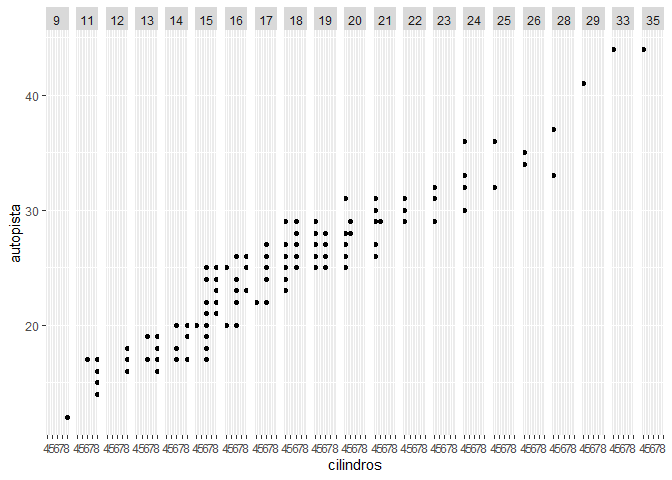<!-- -->

***La variable continua es convertida a una variable categórica y el
gráfico contiene una faceta para cada valor***

## 2.-¿Qué significan las celdas vacías que aparecen en el gráfico generado usando facet_grid(traccion \~ cilindros)? ¿Cómo se relacionan con este gráfico?

``` r
ggplot(data = millas) +
  geom_point(mapping = aes(x = traccion, y = cilindros))
```

<!-- -->

``` r
ggplot(data = millas) +
  geom_point(mapping = aes(x = autopista, y = ciudad)) +
  facet_grid(traccion ~ cilindros)
```

<!-- -->

***Las celdas vacías (facetas) en este gráfico corresponden a
combinaciones de traccion y cilindros que no tienen observaciones.***
***Son las mismas ubicaciones en el gráfico de dispersión de autopista y
ciudad que no tienen gráfica.***

## 3.-¿Qué gráfica el siguiente código? ¿Qué hace . ?

``` r
ggplot(data = millas) +
  geom_point(mapping = aes(x = cilindrada, y = autopista)) +
  facet_grid(traccion ~ .)
```

<!-- -->

``` r
ggplot(data = millas) +
  geom_point(mapping = aes(x = cilindrada, y = autopista)) +
  facet_grid(. ~ cilindros)
```

<!-- -->

***El símbolo . ignora la dimensión al momento de dibujar las facetas
segun las categorías***

## 4.-Mira de nuevo el primer gráfico en facetas presentado en esta sección:

``` r
ggplot(data = millas) +
  geom_point(mapping = aes(x = cilindrada, y = autopista)) +
  facet_wrap(~ clase, nrow = 2)
```

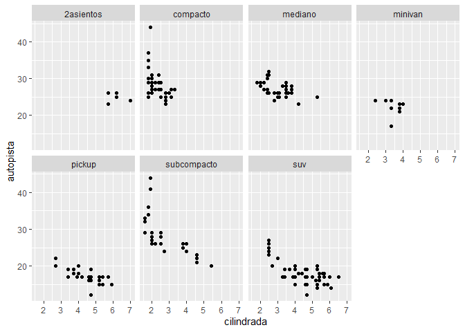<!-- -->

### ¿Cuáles son las ventajas de separar en facetas en lugar de aplicar una estética de color?

***La ventaja de usar “clase” como parte de las facetas en lugar de un
argumento de color es la posibilidad de incluir distintas
categorías(distintas clases).***

### ¿Cuáles son las desventajas?

***La dificultad radica en la dificultad de comparar los valores de
distintas categorías.Basicamente a nivel visual***

### ¿Cómo cambiaría este balance si tuvieras un conjunto de datos más grande?

***Si aumenta mucho el número de categorías va a ser cada vez más
difícil contar con colores distintivos y será difícil distinguirlos.***

### Lee ?facet_wrap. ¿Qué hace nrow? ¿Qué hace ncol? ¿Qué otras opciones controlan el diseño de los paneles individuales? ¿Por qué facet_grid() no tiene argumentos nrow y ncol?

***facet_wrap() opera sobre una única variable.***

***Los argumentos nrow y ncol determinan el número de filas y columnas
al momento de obtener las facetas***

### Cuando usas facet_grid(), generalmente deberías poner la variable con un mayor número de niveles únicos en las columnas. ¿Por qué?

***Hacerlo genera más espacio para las columnas.***

# Parte 4: Objetos Geométricos

### 1.-¿Qué geom usarías para generar un gráfico de líneas? ¿Y para un diagrama de caja? ¿Y para un histograma? ¿Y para un gráfico de área?

``` r
geom_line() #gráfico de líneas
```

    ## geom_line: na.rm = FALSE, orientation = NA
    ## stat_identity: na.rm = FALSE
    ## position_identity

``` r
geom_boxplot() #diagrama de cajas
```

    ## geom_boxplot: outlier.colour = NULL, outlier.fill = NULL, outlier.shape = 19, outlier.size = 1.5, outlier.stroke = 0.5, outlier.alpha = NULL, notch = FALSE, notchwidth = 0.5, varwidth = FALSE, na.rm = FALSE, orientation = NA
    ## stat_boxplot: na.rm = FALSE, orientation = NA
    ## position_dodge2

``` r
geom_histogram() #histograma
```

    ## geom_bar: na.rm = FALSE, orientation = NA
    ## stat_bin: binwidth = NULL, bins = NULL, na.rm = FALSE, orientation = NA, pad = FALSE
    ## position_stack

``` r
geom_area #gráfico de área
```

    ## function (mapping = NULL, data = NULL, stat = "identity", position = "stack", 
    ##     na.rm = FALSE, orientation = NA, show.legend = NA, inherit.aes = TRUE, 
    ##     ..., outline.type = "upper") 
    ## {
    ##     outline.type <- match.arg(outline.type, c("both", "upper", 
    ##         "lower", "full"))
    ##     layer(data = data, mapping = mapping, stat = stat, geom = GeomArea, 
    ##         position = position, show.legend = show.legend, inherit.aes = inherit.aes, 
    ##         params = list(na.rm = na.rm, orientation = orientation, 
    ##             outline.type = outline.type, ...))
    ## }
    ## <bytecode: 0x000000002549a360>
    ## <environment: namespace:ggplot2>

### 2.-Ejecuta este código en tu mente y predice cómo se verá el output. Luego, ejecuta el código en R y verifica tus predicciones.

``` r
#predecimos que el output será un gráfico con cilindrada en el eje x y autopista en el eje identificando los datos por puntos,variando el color de los mismos según el valor indicado en la tracción
ggplot(data=millas,mapping=aes(x=cilindrada, y=autopista,color=traccion))+
  geom_point()+
  geom_smooth(se=FALSE)
```

    ## `geom_smooth()` using method = 'loess' and formula 'y ~ x'

<!-- -->

### 3.- ¿Qué muestra show.legend = FALSE? ¿Qué pasa si lo quitas? ¿Por qué crees que lo utilizamos antes en el capítulo?

``` r
ggplot(data=millas)+geom_smooth(mapping=aes(x=cilindrada, y=autopista,color=traccion),show.legend=FALSE) #Con show.legend=FALSE, la gráfica no aparecerá acompañada de la leyenda que indique la relación entre los colores y la variable tracción,con show.legend=TRUE, si lo hará.
```

    ## `geom_smooth()` using method = 'loess' and formula 'y ~ x'

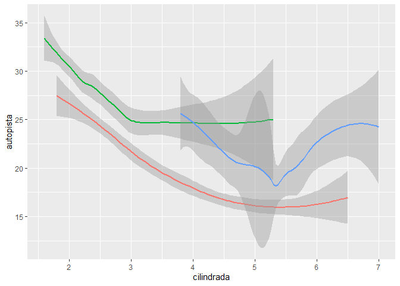<!-- -->

### 4.- ¿Qué hace el argumento se en geom_smooth()?

``` r
ggplot(data=millas,mapping=aes(x=cilindrada, y=autopista,color=traccion))+
  geom_point()+
  geom_smooth(se=TRUE) #Muestra el intervalo de error de cofianza a los lados  de las líneas.
```

    ## `geom_smooth()` using method = 'loess' and formula 'y ~ x'

<!-- -->

### 5.-¿Se verán distintos estos gráficos? ¿Por qué sí o por qué no?ggplot(data = millas, mapping = aes(x = cilindrada, y = autopista)) +

``` r
 ggplot(data = millas, mapping = aes(x = cilindrada, y = autopista)) +
    geom_point() +
    geom_smooth()
```

    ## `geom_smooth()` using method = 'loess' and formula 'y ~ x'

<!-- -->

``` r
ggplot() +
  geom_point(data = millas, mapping = aes(x = cilindrada, y = autopista)) +
  geom_smooth(data = millas, mapping = aes(x = cilindrada, y = autopista))
```

    ## `geom_smooth()` using method = 'loess' and formula 'y ~ x'

<!-- -->

``` r
  #No, se verán distintos porque geom_point() y geon_smooth() tomaran el mismo argunmento de ggplot()
```

### 6.-Recrea el código R necesario para generar los siguientes gráficos:

``` r
ggplot(data = millas, mapping = aes(x = cilindrada, y = autopista)) +
  geom_point() +
  geom_smooth()  #gráfico A
```

    ## `geom_smooth()` using method = 'loess' and formula 'y ~ x'

<!-- -->

``` r
ggplot(data = millas, mapping = aes(x = cilindrada, y = autopista)) +
  geom_smooth(aes(group = traccion), se = FALSE) +
  geom_point()   #gráfico B
```

    ## `geom_smooth()` using method = 'loess' and formula 'y ~ x'

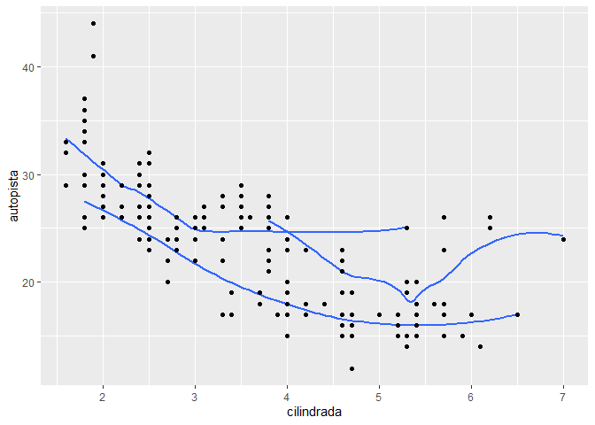<!-- -->

``` r
ggplot(data=millas,mapping=aes(x=cilindrada, y=autopista,color=traccion))+
  geom_point()+
  geom_smooth(se=FALSE) #gráfico C  
```

    ## `geom_smooth()` using method = 'loess' and formula 'y ~ x'

<!-- -->

``` r
ggplot(data=millas,mapping=aes(x=cilindrada, y=autopista))+
  geom_point(aes(color=traccion))+
  geom_smooth()   #gráfico D
```

    ## `geom_smooth()` using method = 'loess' and formula 'y ~ x'

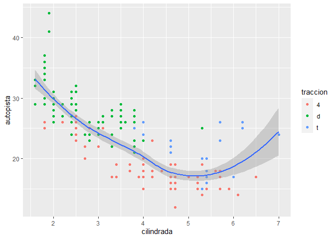<!-- -->

``` r
  ggplot(data = millas, mapping = aes(x = cilindrada, y = autopista)) +
  geom_point(aes(color = traccion)) +
  geom_smooth(aes(linetype = traccion), se = FALSE) #gráfico E
```

    ## `geom_smooth()` using method = 'loess' and formula 'y ~ x'

<!-- -->

``` r
ggplot(data = millas, mapping = aes(x = cilindrada, y = autopista)) +
  geom_point(size = 5, colour = "white") +
  geom_point(aes(colour = traccion))  #gráfico F
```

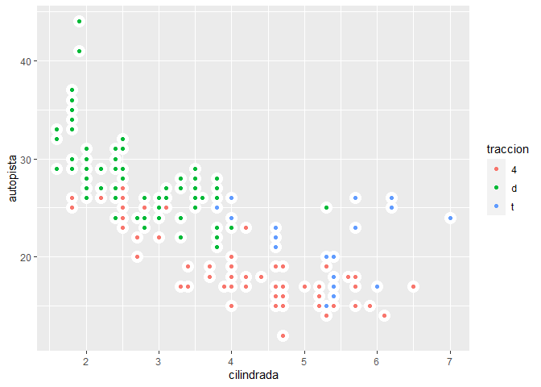<!-- -->

# Parte 5: Gráficos estadisticos

### 1.- ¿Cuál es el geom predeterminado asociado con stat_summary()? ¿Cómo podrías reescribir el gráfico anterior para usar esa función geom en lugar de la función stat?

``` r
data("diamonds")
ggplot(data = diamonds) +
  stat_summary(
    mapping = aes(x =cut, y = depth),
    fun.ymin = min,
    fun.ymax = max,
    fun.y = median
  )  #Gráfico anterior
```

    ## Warning: `fun.y` is deprecated. Use `fun` instead.

    ## Warning: `fun.ymin` is deprecated. Use `fun.min` instead.

    ## Warning: `fun.ymax` is deprecated. Use `fun.max` instead.

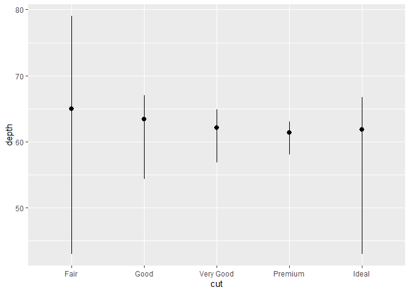<!-- -->

``` r
  #Reescrito usando geom
ggplot(data = diamonds) +
  geom_pointrange(
    mapping = aes(x = cut, y = depth),
    stat = "summary"
  )
```

    ## No summary function supplied, defaulting to `mean_se()`

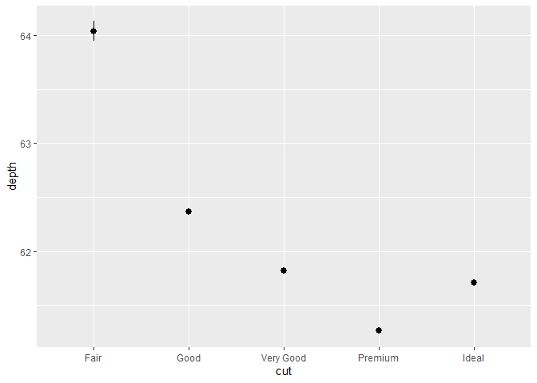<!-- -->

### 2.- ¿Qué hace geom_col()? ¿En qué se diferencia de geom_bar()?

``` r
#geom_bar() hace que la altura de la barra sea proporcional al número de casos en cada grupo. Para que las alturas de las barras representen valores en los datos se utiliza geom_col() en su lugar. geom_bar() utiliza stat_count() por defecto: cuenta el número de casos en cada posición x. geom_col() utiliza stat_identity() por lo que deja los datos tal cual.
```

### 4.- ¿Qué variables calcula stat_smooth()? ¿Qué parámetros controlan su comportamiento?

``` r
#Esta función calcula: y, ymin (intervalo de confianza), ymax, se: error estándar
```

# Parte 6: Ajuste de posición

### 1-.¿Cuál es el problema con este gráfico? ¿Cómo podrías mejorarlo?

``` r
ggplot(data = millas, mapping = aes(x = ciudad, y = autopista)) +
  geom_point()
```

<!-- -->

### Corrección

``` r
ggplot(data = millas, mapping = aes(x = ciudad, y = autopista)) +
  geom_point()
```

<!-- -->

### 2.-¿Qué parámetros de geom_jitter() controlan la cantidad de ruido?

``` r
ggplot(data = millas, mapping = aes(x = ciudad, y = autopista)) +
  geom_jitter()
```

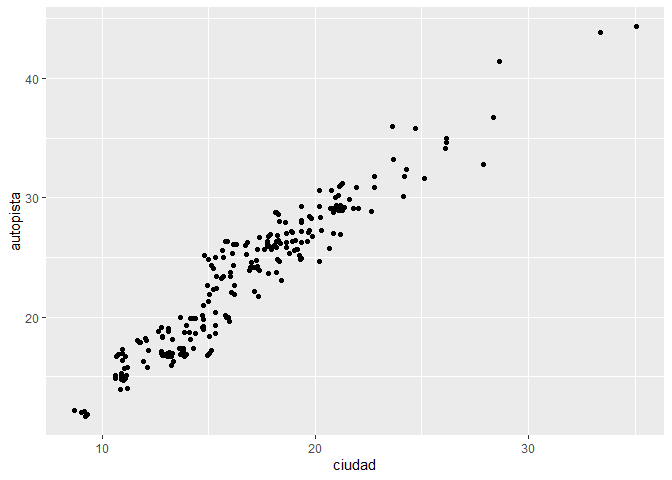<!-- -->

``` r
ggplot(data = millas, mapping = aes(x = ciudad, y = autopista)) +
  geom_jitter(height = 0.5)
```

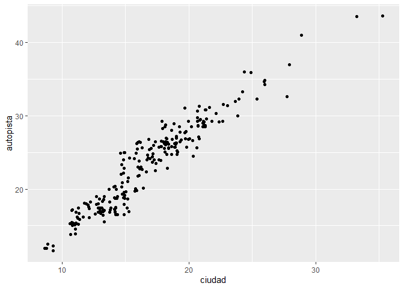<!-- -->

### 3.-Compara y contrasta geom_jitter() con geom_count()

``` r
ggplot(data = millas, mapping = aes(x = ciudad, y = autopista)) +
  geom_jitter()
```

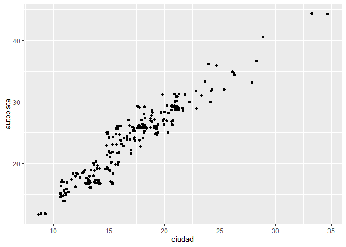<!-- -->

``` r
ggplot(data = millas, mapping = aes(x = ciudad, y = autopista)) +
  geom_count()
```

<!-- -->

### 4.-¿Cuál es el ajuste de posición predeterminado de geom_boxplot()? Crea una visualización del conjunto de datos de millas que lo demuestre.ción del conjunto de datos de millas que lo demuestre.

``` r
ggplot(data = millas, mapping = aes(x = ciudad, y = autopista,notch=T,color=clase)) +
  geom_boxplot()+
  coord_flip()
```

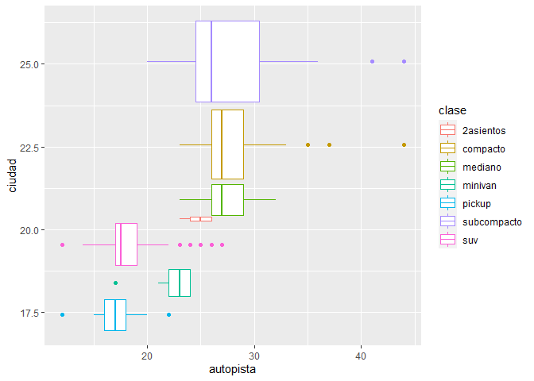<!-- -->

``` r
ggplot(data = millas, mapping = aes(x = ciudad, y = autopista,shape=clase)) +
  geom_jitter()
```

    ## Warning: The shape palette can deal with a maximum of 6 discrete values because
    ## more than 6 becomes difficult to discriminate; you have 7. Consider
    ## specifying shapes manually if you must have them.

    ## Warning: Removed 62 rows containing missing values (geom_point).

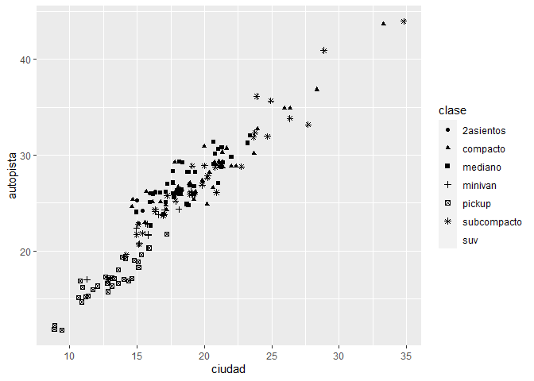<!-- -->

``` r
ggplot(data = millas, mapping = aes(x = ciudad, y = autopista,color=clase, shape=clase)) +
  geom_jitter()
```

    ## Warning: The shape palette can deal with a maximum of 6 discrete values because
    ## more than 6 becomes difficult to discriminate; you have 7. Consider
    ## specifying shapes manually if you must have them.

    ## Warning: Removed 62 rows containing missing values (geom_point).

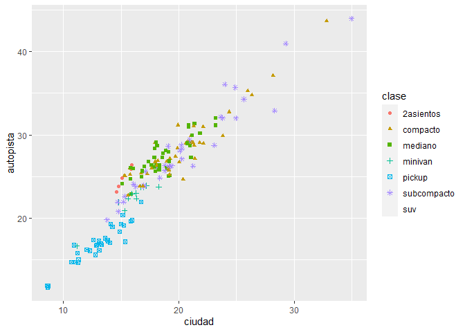<!-- -->
# Parte 7: Sistema de Coordenadas

### 1.-Convierte un gráfico de barras apiladas en un gráfico circular usando coord_polar().

``` r
ggplot(millas, aes(x = factor(1), fill = traccion)) +
  geom_bar()
```

<!-- -->

``` r
ggplot(millas, aes(x = factor(1), fill = traccion)) +
  geom_bar(width = 1) +
  coord_polar(theta = "y")
```

<!-- -->

### 2.-¿Qué hace labs()? Lee la documentación

***labs agrega los títulos de los ejes, título del gráfico y la
leyenda.***

### 3.-¿Cuál es la diferencia entre coord_quickmap() y coord_map()?

***coord_quickmap()usa una aproximación más rápida que ignora la
curvatura de la tierra y ajusta de acuerdo a la razón de latitud y
longitud. ***

***“coord_map()” usa una proyección cartográfica para proyectar la
Tierra sobre una superficie bidimensional. Por defecto usa la Proyección
de Mercator, la cual se aplica a todas las geometrías del gráfico***

### 4.-¿Qué te dice la gráfica siguiente sobre la relación entre la ciudad y la autopista? ¿Por qué es coord_fixed() importante?

``` r
ggplot(data = millas, mapping = aes(x = ciudad, y = autopista)) +
  geom_point() +
  geom_abline() +
  coord_fixed()
```

<!-- -->

***La función coord_fixed() asegura que la línea que genera
geom_abline() tenga un ángulo de 45 grados. De este modo es más fácil
comparar a partir de los casos en que los rendimientos en autopista y
ciudad son iguales***

``` r
ggplot(data = millas, mapping = aes(x = ciudad, y = autopista)) +
  geom_point() +
  geom_abline() +
  coord_fixed()
```

<!-- -->

***Lo que podemos ver es que en todos los modelos el rendimiento en
autopista es superior al rendmiento en ciudad.***

### ¿Qué hace geom_abline()?

***La geom abline agrega una línea con pendiente específica e
intercepción a la trama.***
